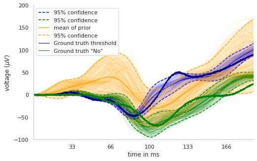

# Inferring microscale parameters from EEG-data with the help of simulation-based inference

My thesis project about extracting microscale parameters from an EEG or MEG with the help of simulation-based inference.

The simulations are based on the HNN-simulator: https://hnn.brown.edu/

## Method

**Neural Incremental Posterior Estimation (NIPE):**

In order to infer a large parameter set from high dimensional data like a time series, we developed a new approach, that incrementally increases the number of parameters used for inference under the assumption that for some parameters mainly a certain range of a time series is informative for restricting the posterior of the parameter. You can find more information about the exact procedure in the methods section of my thesis, which you can find in the ***thesis*** folder.

## Results

Results can be reproduced with the jupyter notebooks under the folder: ***notebooks_for_final_figures***.

Some of the main results were:

- NIPE was more time-efficient in comparison to SNPE_C [^1]

- Later inferred subsets were more over-dispersed for NIPE, while early inferred subsets seemed to be a bit under-dispersed. This could be partially resolved by reallocating simulation budget towards more simulations in the last step and less in the first step

- Compensation mechanisms could be discovered with both methods (SNPE and NIPE), which we investigated with kde density plots and (conditional) correlation matrices. 

- Differences between experimental conditions on the micro-scale level can be revealed with our approach. These were, besides other methods, shown by contour plots of the 2d marginals of the parameter posteriors, which is shown below. For more details, please be referred to my thesis. 

  

  

  

- Posterior predictive checks further showed that the method was able to predict observations of a certain condition.

### Code structure:

- **utils**
  
  - helpers.py: small helper functions, not specific
  - inference.py: functions that either only simulate theta and x, or infer posteriors, or both
  - plot.py: plotting functions, mostly adapted from the sbi toolbox
  - sbi_modulated_functions.py
  - simulation_wrapper: functions that take different number of parameters that are varied for simulations
  
- **summary_features**
  - calculate_summary_features.py: different functions to calculate a certain number of summary statistics. different functions can be compared against each other
  
- **data_load_writer**
  - load_from_file
  
  - write_to_file: defines a class that can store e.g. posteriors, priors, thetas, observations and meta data
  
    

### Result files

##### Toy example:

- ***toy_example_maf_03_05***: Results for NIPE and SNPE comparison of Gaussian toy example. Can be used to compare KL divergence and estimated posterior variances of the marginals.
- ***toy_example_maf_03_05_ratio:*** Results for NIPE-BUDGET (with reallocation of simulation budget) and SNPE comparison of Gaussian toy example. Can be used to compare estimated posterior variances of the marginals.
- ***toy_example_maf_05_05_ratio:*** Results for NIPE-BUDGET (with reallocation of simulation budget) and SNPE comparison of Gaussian toy example. Can be used to compare KL divergence and estimated posterior variances of the marginals. Contains more number of simulations in order to compare KL divergences for different number of simulations. 

##### ERP:

- ***10000sims_17params_05_04_nsf_threshold:*** Stores posterior, thetas, x, meta data and Co. about the simulations for the threshold condition. NIPE approach.
- ***10000sims_17params_11_04_nsf_fake_ratio***: Stores posterior, thetas, x, meta data and Co. about the simulations for the simulated data. Simulation budget was reallocated such that not 10000 simulations were done each step, but (1/7)* 10000 in the first round, 10000 in the second, and (13/7) simulations in the last round. NIPE approach.
- ***10000sims_17params_13_04_nsf_threshold_ratio***: Stores posterior, thetas, x, meta data and Co. about the simulations for the threshold condition, but with reallocation of simulation budget ( (1/7)* 10000 in the first round, 10000 in the second, and (13/7) simulations in the last round). NIPE approach.
- ***10000sims_17params_28_04_nsf_No***: Stores posterior, thetas, x, meta data and Co. about the simulations for the No condition ( (1/10)* 10000 in the first round, 10000 in the second, and (19/0) simulations in the last round). NIPE approach.
- ***multi_round_17params***: Stores posterior, thetas, x, meta data and Co. about the simulations for the the simulated data. SNPE approach.

[^1]: Greenberg, D., Nonnenmacher, M., & Macke, J. (2019, May). Automatic  posterior transformation for likelihood-free inference. In *International Conference on Machine Learning* (pp. 2404-2414). PMLR.

