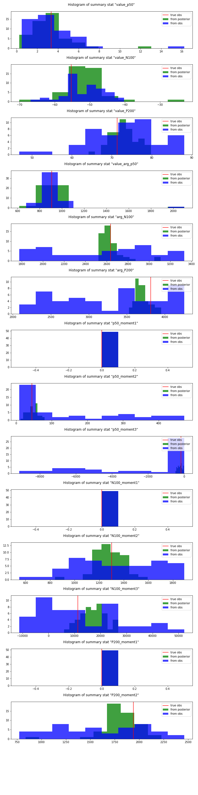

- in which cases does the direct estimation of the posterior density fail? samples not at all in accordance with observation x and why? 
- Benchmark paper: evaluation metrics -> negative log probability of true parameters averaged over different (θo,xo), only feasible if inference is amortized
- looks like SNPE_C is default when I use SNPE? is it?
- 

