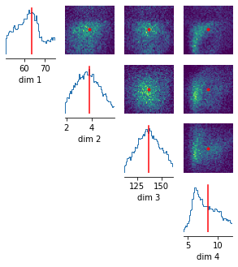

Was ist hilfreiche Summary Statistics für ERPs: 

- Max Filter, MinFilter ?: https://www.wolfram.com/mathematica/new-in-10/time-series/filter-a-time-series.html
- why not only decrease time steps and subtract initial value from all values (in order to normalize)? -> zu viele Werte noch immer? 
  - je mehr summary statistics, desto mehr sim werden benötigt.. 

<u>Stochastizität:</u> 

'the random seed depends on the trial index. You can look at the  specific spikes of the artificial neurons used for the simulation in:

```
net.external_drives[drive_name]['events']
```

If you want to avoid this stochasticity, you can do `sigma=0` in `net.add_evoked_drive`'


Draw samples with respect to what:

- Can we get validational, real data from Jonsson's group? 

- should I compare to the average of say 10 trials with 'real parameters' for a start?

- Problem with intervals? Or several possibilities because of high dim already?

  ‚root:Drawing samples from posterior to estimate the normalizing

​                       constant for `log_prob()`. However, only

​                       0% posterior samples are within the

​                       prior support. It may take a long time to collect the

​                       remaining 10000 samples.‘

Other questions:

- Concerning mechanistic model paper (2020):

  - When I have the posterior, how exactly are samples drawn with respect to the data?

  - Is the network trained to maximize log-prob?
  - um wie viele Kommastellen werden Parameter als Input gegeben? Kann man das beeinflussen? (concerning stochasticity - wäre relevant, wenn nicht viele Kommastellen beachtet werden, weil dann Seed immer auf 1 und keine Stochastizität!)

- bach size variabel? bis jetzt immer 1: running 100 simulations in 100 batches...

- meta data in welchem Format? was ist wichtig? prior, parameter, posterior (was da?), number of simulations, summary statistic used (maybe I can save the function?)

  

Relevante Dinge, die in Thesis beachtet werden sollten:

- welche Parameter haben besonders Einfluss (Sensitivitätsanalyse)

- 'virtually indistinguishable activity can arise from vastly different membrane and synaptic conductances in the STG' (p.12, mechanistic model paper, Goncalces, 2020)

- SNPE provides differentiable estimate of posterior --> network ouput can be highly preserved as we go along the path of high probability

- parameters can compensate each other - so it's not certain that a specific parameter is related to ERP signal, rather it is probable that different parameter settings are possible. 

  'conditional correlations' are often preserved

- choice of summary statistics can influence the result!!

4 parameters, 100 simulations, ~6 summary statistics values (max, min, abs_diff, argmin, argmax, moments)



Next steps?

- ask Jonsson's group which parameters are most relevant?
- summary statistics? do we actually need it or is downsampling enough for ERPs?
- sensitivity anaylsis?